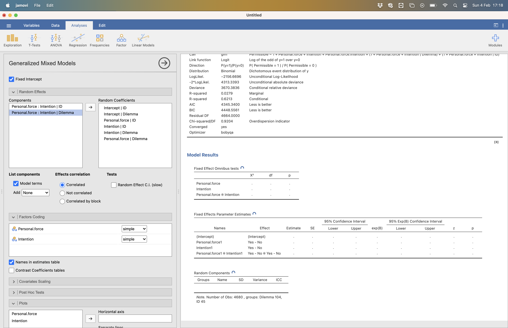

Here I provide a walk through for the statistical methods that we will employ in the practical. You can either follow the analysis in [R] or click on the [Jamovi] version in the menu to the left. We will load data, run generalized linear mixed effects models, plot the models and then do some model comparison (including Bayesian if you are using R!). The data is taken from our in-class experiment where you good people completed the moral sense task. The experiment set out to test whether the dual process theory v2.0 (personal force + intention) is better than v1.0 (personal/impersonal) at explaining moral judgments. We had the hypothesis that
 
>If dual process theory v2.0 is a better model of the moral mind than v1.0, then the model should fit the data better. 

***
<br>

# R
You have decided to take your first steps toward learning a very powerful statistical programming language (sounds impressive, right!). R has a universe of statistical and data science tools (what we call "packages") that allow you to do just about anything you want to with data. Obviously, I am not going to be able to fully teach you R through this one example analysis but there will be enough here for you to be able to run the analyses for your own experiment and begin to see why this might me something worth learning and investing your time in. There are loads of great [introductions for R available for free online](https://glennwilliams.me/r4psych/) to help build a deeper understanding.     
<br> 

## install R and RStudio
If you have not installed R & RStudio, then do so now.

<iframe width="840" height="472.5" src="https://www.youtube.com/embed/PGocx5cfq5w?si=ubd0OwwBlF5fNBwt" title="YouTube video player" frameborder="0" allow="accelerometer; autoplay; clipboard-write; encrypted-media; gyroscope; picture-in-picture; web-share" allowfullscreen></iframe>

<br>

## open the R script in RStudio
Below I walk you through the R code for the analysis of the in-class study. You can download a copy of the [script ("Analysis of in-class study.R")](https://ele.exeter.ac.uk/course/view.php?id=10296) from the module ELE page. To open the script in RStudio click **"File" &rarr; "Open file..."** and select the file from your downloads folder. 


<br> 

## import data and set coding
Next, we will need to import the data from the in-class study. We download the [datafile ("data example.csv")](https://ele.exeter.ac.uk/course/view.php?id=10296) from the module ELE page. To import the data in RStudio click **"Import Dataset" &rarr; "From Text (base)..."** and select the file from your downloads folder.


Next, name the file "df" and select **"Yes"** for the heading option and click **"Import"**.


You should see the "df" file appear in the top right of your screen in the Environment panel. It tells you that there are 4680 observations and 11 variables. You can have a look at the data by clicking on the spreadsheet icon (table) to the right of the data.


You can see the ID for the participant, the dilemma, and the model parameters for that dilemma along with the reaction time and the moral judgment (permissible).

Ok, so we have the data and the script which is all we need. Let's walk through the code so you get an understanding of what's going on.
<br> 

If you look in the console you will see the code behind the opening the data for your set-up (machine, OS, folders)

```{r message=FALSE}
df <- read.csv("~/Library/CloudStorage/Dropbox/Documents/My data/Moral sense task/practical/data example.csv")
```

## packages
First, we will need to install and/or load the packages that we need into RStudio. To run the code just make sure your cursor is on the right line and click select **"Run"**. This will run the current lines of code.
```{r message=FALSE}
# Package names
packages <- c("ggplot2",  "tidyverse", "lme4", "lmerTest", "sjPlot", "performance")

# Install packages not yet installed
installed_packages <- packages %in% rownames(installed.packages())
if (any(installed_packages == FALSE)) {
  install.packages(packages[!installed_packages])
}

# Packages loading
library(ggplot2)
library(emmeans)
library(lme4)
library(lmerTest)
library(tidyverse)
library(sjPlot)
library(performance)

```

For ease of interpretation, we set deviation coding for the factors (what does that mean?! This makes it easier to interpret the estimates of the effect size with complex models including interactions, so we can interpret the estimates a bit like an ANOVA - the estimates are for the main effects and interactions.
```{r message=FALSE, results='hide'}
# make sure everything is factor
df$Task.Name <- as.factor(df$Task.Name)
df$Personal <- as.factor(df$Personal)
df$DPv1.0.Permissible <- as.factor(df$DPv1.0.Permissible)
df$Personal.force <- as.factor(df$Personal.force)
df$Intention <- as.factor(df$Intention)
df$DPv2.0.Permissible <- as.factor(df$DPv2.0.Permissible)

#set deviation contrasts for ease of interpretation -.5 vs .5
c<-contr.treatment(2)
my.coding<-matrix(rep(1/2, 2), ncol=1)
my.simple<-c-my.coding
my.simple

#keys  .5 Q-Yes,  -.5 P-Yes 
contrasts(df$Task.Name)<-my.simple
contrasts(df$Task.Name)

#personal .5 Yes, -.5 No
contrasts(df$Personal)<-my.simple
contrasts(df$Personal)

#prediction DPv1.0 act no intended .5 Yes, -.5 No
contrasts(df$DPv1.0.Permissible)<-my.simple
contrasts(df$DPv1.0.Permissible)

#personal force .5 Yes, -.5 No
contrasts(df$Personal.force)<-my.simple
contrasts(df$Personal.force)

#intention .5 Yes, -.5 No
contrasts(df$Intention)<-my.simple
contrasts(df$Intention)

#prediction DPv2.0 .5 Yes, -.5 No 
contrasts(df$DPv2.0.Permissible)<-my.simple
contrasts(df$DPv2.0.Permissible)

```
<br> 

## generalized linear mixed models
We fit two generalized linear mixed models (GLMM) in order to test our hypothesis. We attempt to specify "maximal" models [(see Barr et al., 2013)](https://www.sciencedirect.com/science/article/abs/pii/S0749596X12001180?via%3Dihub) with all random intercepts and slopes for participant and dilemma. Basically, we are making sure that our results can generalise to the population of participants and dilemmas that we have sampled from.   

<br> 

### GLMM for dual process v1.0
Let's fit the GLMM for the dual process v1.0 model. We can see the summary and get some 95% CIs.
```{r, attr.output='style="max-height: 500px;"'}
#Dual process v1.0 model
DPv1.0<- glmer(Permissible ~ Personal +  (1+Personal|ID) + (1+Personal|Dilemma),  data=df, family = binomial(link = "logit"))

summary(DPv1.0)

confint(DPv1.0, parm = "beta_", method="Wald")
```

The personal (vs. impersonal) parameter (IV or fixed effect) doesn't seem to differ significantly from the null. The log odds ratio = 0.134 so the odds ratio is exp(0.134) = 1.14 about equal odds. The 95% CIs show a fair amount of imprecision in the estimate - we need more data for more precision. We can also see the information criterion methods for model comparison with AIC = 4310.8 and BIC =  4362.4.

We can plot the data from the model. 
```{r, attr.output='style="max-height: 500px;"'}
set_theme(base = theme_classic())
plot_model(DPv1.0, terms = "Personal", type = "pred")
```

Here we can see similar rates of permissible judgments across personal and impersonal conditions. The 95% CIs on the estimates show a fair amount of imprecision in the estimate, at least for the personal condition (this reflects the relative low number of personal dilemmas in the task).

<br> 

### GLMM for dual process v2.0
OK, let's do the GLMM for dual process model v2.0. Here we add the parameters (personal force & intention) and their interaction to the model. We include all of the random variables except the random slopes for the two interaction terms ("Personal.force:Intention|ID & Personal.force:Intention|Dilemma)". If we included these two random variables the model will not converge/work as the random effects data structure is too complex for the data we have.   
```{r, attr.output='style="max-height: 500px;"'}
#Dual process v2.0 model
DPv2.0<- glmer(Permissible ~ Personal.force*Intention +  (1+Personal.force+Intention|ID) + (1+Personal.force+Intention|Dilemma),  data=df, family = binomial(link = "logit"), control = glmerControl(optimizer = "nloptwrap", optCtrl = list(algorithm =  "NLOPT_LN_NELDERMEAD")))

summary(DPv2.0)

confint(DPv2.0, parm = "beta_",method="Wald")

```

The parameters for personal force and intention are both significant. The log odds ratio for personal force = 0.90 so the odds ratio is exp(0.90) = 2.46, so (weirdly) the odds are about twice as likely that an action will be seen as permissible if it has personal force. The 95% CIs show a fair amount of imprecision in the estimate - we need more data for more precision. More in line with expectations, we can see the log odds ratio for intention (means vs. side-effect)  = -1.425 so the odds ratio is exp(-1.425) = .24, so the odds are about four times as likely that an action will be seen as permissible if it is not intentional - i.e., the harm is a side-effect not a means. The 95% CIs also show a fair amount of imprecision in the estimate. Finally, we can also see the information criterion model comparison indices, AIC = 4345.3 and BIC = 4448.6.

We can plot the data from the model. 
```{r, attr.output='style="max-height: 500px;"'}
set_theme(base = theme_classic())
plot_model(DPv2.0, type = "int")
```
<br> 

## model comparison 
To test our hypothesis we want to see which model best fits the data, so let's have a look at the model comparisons.

### Bayes factor model comparison
Now we can compare the models using Bayes Factors to get the relative likelihood of the models given the data we have.
```{r, attr.output='style="max-height: 500px;"'}
test_bf(DPv2.0, DPv1.0)
```
This shows us that the dual process v1.0 model (compared to v2.0) is a lot, BF = 5.02 * 10^18^ (this is scientific notation for a big number: 5020000000000000000), of times more likely than the dual process v2.0 model given the data. A Bayes Factor of > 100 is extreme evidence for the hypothesis/model. See the table below for some interpretations of different Bayes Factors. Bayes Factors are useful as they provide a quantitative measure of evidence rather than a single cut-off of p < .05. They can also provide evidence for the null. Rather than just simply failing to reject the null hypothesis as in classic statistics BFs can provide support for the null. 


<br> 

### information criterion (AIC and BIC) 
We can also look at our more traditional information criterion indices.
```{r, attr.output='style="max-height: 500px;"'}
compare_performance(DPv2.0,DPv1.0)
```
Here we see what we could have seen in the model outputs above: that the dual process v1.0 model has a relatively better fit than the v2.0 model. That is, both it's AIC 4310.8 (vs. 4345.3) and BIC 4362.4 (vs. 4448.6) are lower than those of v2.0.  

# Jamovi

## install Jamovi

If you have not installed Jamovi, then do so now.

<iframe width="840" height="472.5" src="https://www.youtube.com/embed/QVNQh9JerjA?si=KcDLge1pFOMEVgHg" title="YouTube video player" frameborder="0" allow="accelerometer; autoplay; clipboard-write; encrypted-media; gyroscope; picture-in-picture; web-share" allowfullscreen></iframe>

<br>

## import data and add module

Next, we will need to import the data from the in-class study. We download the [datafile ("data example.csv")](https://ele.exeter.ac.uk/course/view.php?id=10296) from the module ELE page. To import the data in Jamovi click the menu (three horizontal bars at the top left) button then **"Special Import"** and select the data file from your downloads folder.


You should see the variables in the dataset appear. 

Next, we need to add a module (i.e., package) from the Jamovi library so that we can run a generalised linear mixed effects model. Select **"+"** (in the top right) and click **"jamovi library"**.


Type "mixed" in the search bar and select **"install"** for the "gamlj" module.


<br> 

## generalized linear mixed models

We fit two generalized linear mixed models (GLMM) in order to test our hypothesis. We attempt to specify "maximal" models [(see Barr et al., 2013)](https://www.sciencedirect.com/science/article/abs/pii/S0749596X12001180?via%3Dihub) with all random intercepts and slopes for participant and dilemma. Basically, we are making sure that our results can generalise to the population of participants and dilemmas that we have sampled from.   

<br> 

### GLMM for dual process v1.0

First, we need to change dilemma into a nominal variable (Jamovi doesn't automatically recognise it as one) so we can add it as a random variable.

Click the **"Data"** tab and then click on the column heading for **"Dilemma"**. Now change the "Measure type" to **"Nominal"**. You should see that the variable type icon in the column heading has changed.


Let's fit the GLMM for the dual process v1.0 model. Select the **"Analysis"** tab and then **"Linear Models" &rarr; "Generalized mixed models"** 


Place "Permissible" into the "Dependent Variable" box by selecting it and then selecting the **"&rarr;"**. Select "Personal" and place it into the "Factors" box. Finally, select "ID" (participant ID) and "Dilemma" and place them into the "Cluster variables" (random variables) box. Select "Confidence intervals" **"For estimates"**for   

 

In the random effects panel select all of the random variables (Cluster variables) and place them in the "Random coefficients" box. The model will run automatically and provide you with a summary. The personal (vs. impersonal) parameter (IV or fixed effect) doesn't seem to differ significantly from the null. The log odds ratio = 0.134 so the odds ratio is exp(0.134) = 1.14 about equal odds. The 95% CIs show a fair amount of imprecision in the estimate - we need more data for more precision. We can also see the information criterion methods for model comparison with AIC = 4310.8 and BIC =  4362.4.

 

We can plot the model using the "Plot" panel. Select personal and put it into the "Horizontal axis" box. Select "Confidence intervals." Here we can see similar rates of permissible judgments across personal and impersonal conditions. The 95% CIs on the estimates show a fair amount of imprecision in the estimate, at least for the personal condition (this reflects the relative low number of personal dilemmas in the task).

 

### GLMM for dual process v2.0

OK, let's do the GLMM for dual process model v2.0. Here we add the parameters (personal force & intention) and their interaction to the model. We remove "Personal" from the "Factors" box and add "Personal.force" and "Intention". 


We need to place all of the random variables in the "Random Effects" panel, except the random slopes for the two interaction terms ("Personal.force:Intention|ID & Personal.force:Intention|Dilemma)", into the "Random Coefficients" box. If we included these two random variables the model will not converge/work as the random effects data structure is too complex for the data we have.   

 

For ease of interpretation, we also set "simple" coding for the factors in the "Factor Coding" panel. What does that mean?! This makes it easier to interpret the estimates of the effect size with complex models including interactions, so we can interpret the estimates a bit like an ANOVA - the estimates are for the main effects and interactions. The model may take some time to compute (5-10 mins), depending on the speed of your machine. Let's have a look at the model summary.

 

The parameters for personal force and intention are both significant. The log odds ratio for personal force = 0.90 so the odds ratio is exp(0.90) = 2.46, so (weirdly) the odds are about twice as likely that an action will be seen as permissible if it has personal force. The 95% CIs show a fair amount of imprecision in the estimate - we need more data for more precision. More in line with expectations, we can see the log odds ratio for intention (means vs. side-effect)  = -1.425 so the odds ratio is exp(-1.425) = .24, so the odds are about four times as likely that an action will be seen as permissible if it is not intentional - i.e., the harm is a side-effect not a means. The 95% CIs also show a fair amount of imprecision in the estimate. Finally, we can also see the information criterion model comparison indices, AIC = 4345.3 and BIC = 4448.6.

## model comparison 

To test our hypothesis we want to see which model best fits the data, so let's have a look again at the traditional information criterion indices. We see from the model summaries above that the dual process v1.0 model has a relatively better fit than the v2.0 model. That is, both it's AIC 4310.8 (vs. 4345.3) and BIC 4362.4 (vs. 4448.6) are lower than those of v2.0.  

# Example write-up

To test our hypothesis we fitted two mixed effects models to examine the relationship between the dual process models and moral judgment. We fitted the respective model parameters as fixed effects and participant and dilemma as random effects. The dual process model v1.0 “Personal” parameter did not have a significant effect on moral judgment, *b* = 0.13, 95% CIs [-0.82, 1.09], *p* = .78 (see Figure 1). Model fit statistics revealed that AIC = 4310.8 and BIC = 4362.4.

The dual process model v2.0 showed a significant effect of intention, *b* = -1.4247, 95% CIs [-2.18, -0.67], *p* < 0.001. Figure 2 shows that when the harm is intended (a means) the action is judged as less permissible. Personal force also showed a significant effect, *b* = 0.90, 95% CIs [0.12, 1.68], *p* = 0.02.  Figure 2 shows how when the harm was caused by personal force the action was judged as more permissible. We can also see that this is driven by unintended personal force, although the interaction between personal force and intention was not significant, *b* = -1.42, 95% CIs [-2.90, 0.05], *p* = 0.06. Model summary fit statistics were AIC = 4345.3  and BIC = 4448.6

Comparison of the model fit statistics suggest that the dual process model v1.0 better fit the data as it has a lower AIC and BIC. Indeed, we find extreme evidence in favour of the dual process v1.0 model (compared to v2.0), BF = 5.02 * 10^18^. This is despite that fact that v2.0 did show some significant effects. These fit statistics and model comparison are relative and not absolute. The fact that dual process v2.0 has significant effects but v1.0 still fits the data better may suggest that both models do not fit the data that well. Future research is needed to test alternative models. 
